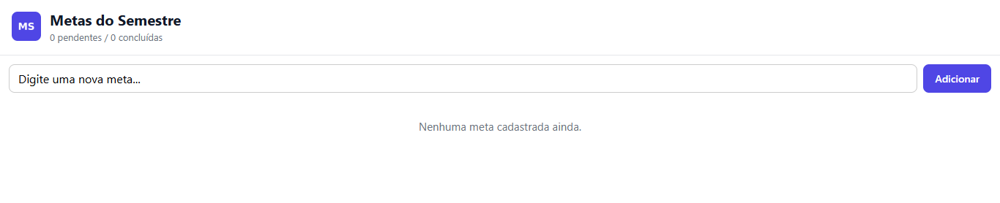
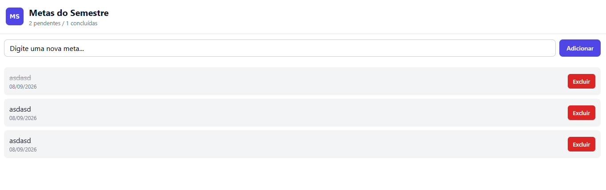
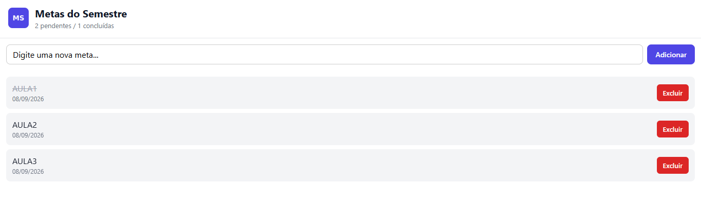

# MetasSemestre

App de metas acadêmicas em React Native (Expo), com persistência local via
AsyncStorage.

## Funcionalidades

- Cadastro de metas de estudo (texto + data de criação)
- Remoção de metas
- Marcar meta como concluída (desafio opcional) com contador
  "X pendentes / Y concluídas" no cabeçalho
- Persistência local: as metas continuam salvas mesmo depois de fechar o app

## Como rodar

```bash
npm install
npx expo start
```

Escaneie o QR code com o app Expo Go (Android/iOS) ou rode em um emulador.

## Estrutura

MetasSemestre/
├── App.js
├── components/
│ ├── MetaInput.js (TextInput + Pressable de adicionar)
│ └── MetaList.js (FlatList + item com Pressable de excluir/concluir)
└── assets/
├── icon.png
├── adaptive-icon.png
├── splash.png
└── favicon.png


> Os ícones em `assets/` são placeholders gerados automaticamente (fundo roxo
> com "MS"). Troque por imagens suas quando for estilizar o app.

## Onde estão os useEffect (persistência)

Os dois `useEffect` ficam em `App.js`:

- **useEffect de carga** (linhas ~16–29): roda uma única vez, com array de
  dependências vazio (`[]`), quando o componente `App` é montado. Ele busca
  a chave `@metas_semestre` no `AsyncStorage`, faz `JSON.parse` do resultado
  e popula o state `metas`. Ao final, marca `carregado = true`.
- **useEffect de salvamento** (linhas ~32–41): tem `[metas, carregado]` como
  dependências, então roda toda vez que a lista de metas muda. Ele só grava
  no `AsyncStorage` depois que o carregamento inicial terminou (`carregado`
  true), para não sobrescrever os dados salvos com uma lista vazia antes de
  carregar. Usa `JSON.stringify` para salvar o array como string.

Ambos os efeitos têm `try/catch` com `Alert` amigável em caso de erro.

## Prints

1. **Lista vazia** — primeira abertura do app, sem metas cadastradas.
   
2. **Com itens** — após cadastrar algumas metas.
   
3. **Após reabrir o app** — mostrando que os dados persistiram.
   

## Pull Request

Link do PR: `<cole aqui o link do seu PR>`